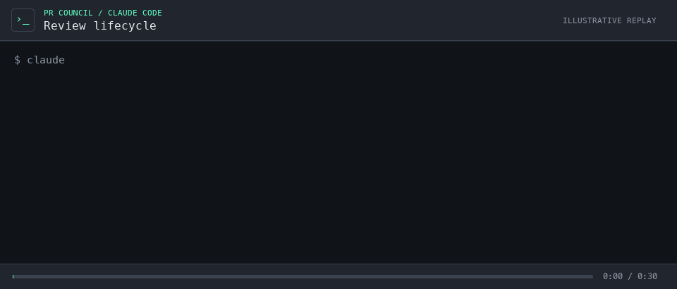

# pr-council-mcp

[](https://github.com/salesforce-misc/pr-council-mcp/actions/workflows/ci.yml)
[](https://github.com/salesforce-misc/pr-council-mcp/actions/workflows/ci.yml)
[](https://pypi.org/project/pr-council-mcp/)
[](https://pypi.org/project/pr-council-mcp/)
[](https://github.com/salesforce-misc/pr-council-mcp/blob/main/LICENSE.txt)

> **Platform support:** macOS only for now. [Why Linux support is pending](https://demianbrecht.com/posts/pr-council-a-runnable-experiment-in-agentic-engineering/#sandboxing-currently-macos-only).

[](https://demianbrecht.com/posts/pr-council-a-runnable-experiment-in-agentic-engineering/)

*Illustrative, time-compressed replay with a fictional PR. [Open the interactive version and transcript](https://demianbrecht.com/posts/pr-council-a-runnable-experiment-in-agentic-engineering/).*

`pr-council-mcp` is a playground for agentic engineering end to end. It explores production concerns such as durable
workflows, model coordination, sandboxed tools, secrets, human approval, and observability in a local environment with
a small footprint: one stdio MCP server backed by SQLite, without a service stack to deploy.

The concrete application is multi-model review of GitHub pull requests. Independent quality and security reviewers
inspect a PR, deliberate over their findings, and combine retained issues into a preview. The calling agent shows that
preview to a human; only after explicit approval does the server publish inline comments and a `COMMENT`-only summary
to GitHub.

> **Status: early development (alpha).** The design, tool surface, and configuration are still changing and may
> break between versions. Expect rough edges, and expect the interfaces to evolve as both tracks are explored.

## Quickstart

The server currently runs on macOS and requires Python 3.12+. Install
[`uv`](https://docs.astral.sh/uv/getting-started/installation/), `git`, [`rg`](https://github.com/BurntSushi/ripgrep),
and [`gh`](https://cli.github.com/), then authenticate GitHub:

```bash
gh auth login
gh auth status
```

On first launch, the server creates `~/.config/localmcp/localmcp.toml` (or the path beneath `$XDG_CONFIG_HOME`) with
this base configuration if the file does not exist. The `llm`, `secrets`, and `observability` tables are owned by
localmcplib; pr-council owns only its optional `pr_review` table:

```toml
schema_version = 1

[llm]
backend = "native"

[secrets.openai_api_key]
env_vars = ["OPENAI_API_KEY"]

[secrets.anthropic_api_key]
env_vars = ["ANTHROPIC_API_KEY"]
```

On macOS, store the keys in your default Keychain. Each command prompts for the key without putting it in shell
history:

```sh
security add-generic-password -U -s localmcp -a openai_api_key -w
security add-generic-password -U -s localmcp -a anthropic_api_key -w
```

Only the providers used by your selected models need keys. macOS may ask you to allow the server to read these Keychain
items. The server starts without keys and reports missing credentials when a review is requested.

Install the package on demand from public PyPI in your MCP client configuration.

### Claude Code

Add `.mcp.json`:

```json
{
  "mcpServers": {
    "pr-council-mcp": {
      "command": "uvx",
      "args": ["--from", "pr-council-mcp", "pr-council-mcp"]
    }
  }
}
```

### opencode

Add `opencode.jsonc`:

```jsonc
{
  "$schema": "https://opencode.ai/config.json",
  "mcp": {
    "pr-council-mcp": {
      "type": "local",
      "command": ["uvx", "--from", "pr-council-mcp", "pr-council-mcp"]
    }
  }
}
```

## How it works

Reviews are checkpointed operations rather than one long MCP request. The client starts a review, polls it, presents
the exact revision-bound preview, and publishes only after explicit approval. Restarts can recover unfinished work,
and publication revalidates the PR revision and approved payload before writing.

By default the server prepares an isolated managed worktree. Reviewer and deliberator models receive one bounded Bash
tool inside a read-only macOS Seatbelt sandbox. They can inspect source and Git history with ordinary local tools, but
cannot write files, access the network or credentials, or execute repository code. A local-checkout mode is also
available when cloning a large repository is impractical.

The MCP surface intentionally stays small: start, status, preview, commit, and cancel. Published reviews contain
inline comments plus a `COMMENT`-only summary; the server never approves or rejects a pull request.

## Tools

Inspect the MCP server's tool schema for complete arguments and return models.

| Tool | What it does | Important behavior and requirements |
| --- | --- | --- |
| `pr_council_start` | Starts a durable initial or follow-up PR review and returns an opaque operation ID. | Accepts a GitHub PR URL, source mode, finalized context, review mode, optional baseline, iterations, and optional model overrides. It never publishes comments. |
| `pr_council_get` | Polls review status, progress, failures, and completion data. | The calling agent retains the operation ID and polls until the review is ready, terminal, or needs action. |
| `pr_council_preview` | Returns the exact revision-bound summary and inline comments. | Read-only. The calling agent presents this payload for human review without changing it. |
| `pr_council_commit` | Publishes one approved preview as inline comments plus a `COMMENT`-only summary. | Requires the preview revision and payload hash, revalidates the PR endpoints and authenticated GitHub user, and never approves or rejects the PR. |
| `pr_council_cancel` | Requests cooperative cancellation of one owned operation. | Cancellation is unavailable once publication has begun. |

## Basic configuration

Configuration lives at `~/.config/localmcp/localmcp.toml`, or beneath `$XDG_CONFIG_HOME` when set. Shared root values
are inherited by every local MCP server and `[server.pr-council-mcp]` overrides this server's application settings.
Unknown application keys are rejected. The generated configuration uses the default reviewer matrix.

Secrets resolve from declared environment aliases first and the shared `localmcp` OS-keyring service second. The
native backend resolves `openai_api_key` and `anthropic_api_key` as required by the selected models. GitHub
authentication is owned by `gh`, with `GH_TOKEN` or `GITHUB_TOKEN` available as overrides. Secret values are never
logged.

Structured logs are written only to
`~/.local/state/localmcp/pr-council-mcp/logs/pr-council-mcp.log` (or beneath `$XDG_STATE_HOME`) because stdout and
stderr carry the MCP protocol. Langfuse tracing is optional and enabled with `LOCALMCP_LANGFUSE_ENABLED=true`.
Tool inputs and outputs remain suppressed unless `LOCALMCP_LANGFUSE_CAPTURE_PAYLOADS=true` is also set.

## License

[Apache-2.0](LICENSE.txt)
